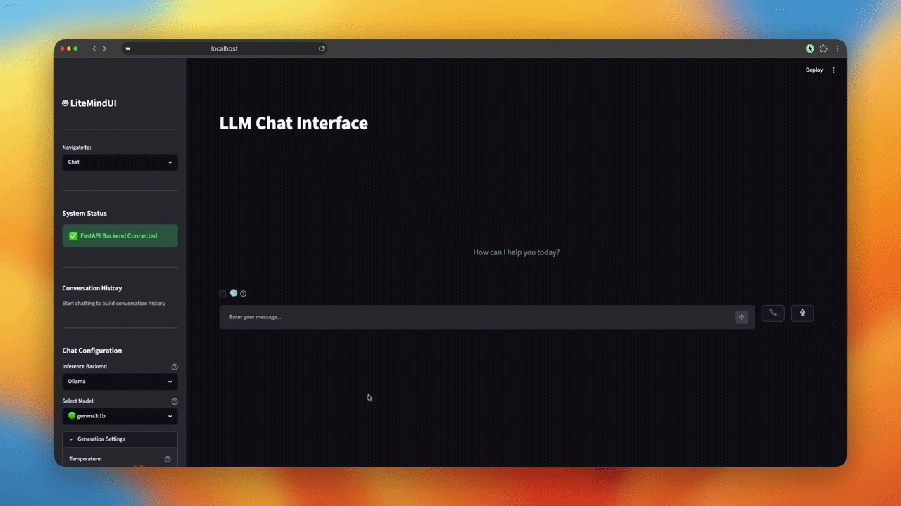

# LiteMindUI

LiteMindUI is a local-first AI workspace with a FastAPI backend and a production-grade **Next.js / TypeScript** frontend for chat, RAG, web search, and voice-enabled workflows. It supports Ollama for local models plus OpenRouter and Nvidia NIM for LiteLLM-hosted models.



## Quick start

| Mode | Best for | Command |
| --- | --- | --- |
| Quick install | Fastest path with prebuilt Docker images | `curl -fsSL https://raw.githubusercontent.com/debabratamishra/litemind-ui/main/install.sh \| bash` |
| Docker from source | Running the repo locally with the checked-out source | `make up` |
| Native install | Development on the Python + Node.js codebase | `uv sync --group all && npm --prefix nextjs-frontend install` |

### 1. Quick install with prebuilt Docker images

```bash
curl -fsSL https://raw.githubusercontent.com/debabratamishra/litemind-ui/main/install.sh | bash
```

This downloads `docker-compose.hub.yml`, prepares the required runtime directories, and starts the app with prebuilt images.

### 2. Run from source with Docker

```bash
git clone https://github.com/debabratamishra/litemind-ui.git
cd litemind-ui
make up
```

Useful variants:

- `make dev` - development compose stack
- `make prod` - production-style compose stack
- `make hub-up` - pull and run Docker Hub images from this repo

### 3. Run natively for development

```bash
git clone https://github.com/debabratamishra/litemind-ui.git
cd litemind-ui
uv sync --group all
mkdir -p uploads
```

If you want to override defaults, copy `.env.example` to `.env` before starting the services.

**Backend:**

```bash
uv run uvicorn main:app --host 0.0.0.0 --port 8000
```

**Frontend (Next.js):**

```bash
cd nextjs-frontend
npm install
npm run dev       # development server at http://localhost:3000
# or
npm run build && npm start   # production server
```

## Default URLs

| Surface | URL |
| --- | --- |
| **Next.js frontend** | `http://localhost:3000` |
| FastAPI backend | `http://localhost:8000` |
| API docs | `http://localhost:8000/docs` |
| Health check | `http://localhost:8000/health` |

## Authentication

LiteMindUI requires every user to register or sign in before using the app. Auth is powered by self-hosted **Supabase Auth (GoTrue)** — an open-source, JWT-based identity server you run yourself (no third-party account required).

- **Login methods:** email + password.
- **Session (hybrid):** on login the backend sets an HTTP-only `access_token` cookie for the browser **and** returns the JWT in the response body for CLI/desktop clients (e.g. `litemind-cli`, `litemind-desktop`). The web client keeps the token in memory only (never `localStorage`) and revalidates via `GET /api/auth/me` on page load.
- **Per-user isolation:** every chat session, persisted conversation, and RAG context is namespaced by the authenticated user's id, so one user can never read or mutate another user's data.
- **Multiple clients:** the same backend auth API is shared by the Next.js web UI, the CLI, and future desktop apps.

### Running GoTrue (the auth server)

Mode is selected by `AUTH_MODE` in `.env`:

- **Docker (recommended with `make up`):** `docker-compose.yml` already includes the `gotrue` and `db` (PostgreSQL) services. Set `GOTRUE_JWT_SECRET` (a long random string) and `POSTGRES_PASSWORD` in `.env`, then `make up`. The backend reaches GoTrue at `http://gotrue:9999` and Postgres at `db:5432` inside the compose network.
- **Standalone (native `uv run`):** run GoTrue as a container while the backend and Postgres run natively on the host:
  ```bash
  make gotrue-up     # starts the GoTrue container pointed at your local Postgres
  make gotrue-down   # stops and removes it
  ```

### Required environment variables

Copy `.env.example` → `.env` and set at minimum:

| Variable | Purpose |
| --- | --- |
| `GOTRUE_API_URL` | GoTrue REST base URL (default `http://localhost:9999`) |
| `GOTRUE_JWT_SECRET` | HS256 secret GoTrue signs JWTs with — **must match** the value GoTrue runs with. Leave blank to disable JWT verification. |
| `AUTH_MODE` | `docker` or `standalone` |
| `DATABASE_URL` | PostgreSQL connection string for users + conversations |
| `POSTGRES_PASSWORD` / `POSTGRES_USER` / `POSTGRES_DB` | Postgres credentials |

On first run, register an account at `/register`, then sign in at `/login`. SMTP variables (`SMTP_*`) are optional and only needed later for email verification / password reset.

## Frontend features

The Next.js frontend is a full TypeScript application built on:

- **Next.js 16 App Router** with server components and streaming
- **Tailwind CSS + shadcn/ui** — production-ready component library
- **Dark / light theme** — persisted preference with one-click toggle
- **Streaming responses** — SSE for chat, plain-text streams for RAG and web search
- **Generative UI** — AI responses can embed charts (bar/line/pie), tables, metrics, progress bars, and interactive buttons using fenced `ui:*` blocks
- **Voice input** — Web Speech API microphone capture with live transcription, auto-submits on recognition
- **Markdown rendering** — syntax-highlighted code blocks, GFM tables, and more via `react-markdown`
- **RAG / Knowledge Base** — drag-and-drop file upload, duplicate detection, multi-agent and hybrid search options
- **Web Search** — SerpAPI-grounded responses with inline streaming results
- **Settings page** — model catalogue (local + cloud), backend configuration (Ollama, OpenRouter, Nvidia NIM), generation parameter tuning

## Repository layout

```text
app/
  backend/         FastAPI routes, schemas, and API logic
  core/            shared configuration and application wiring
  ingestion/       document ingestion and knowledge-processing flow
  services/        model, RAG, speech, and web-search integrations
  skills/          pluggable chat and RAG capability layer
nextjs-frontend/   Next.js / TypeScript production frontend
  src/
    app/           App Router pages (chat, rag, web-search, settings)
    components/    Shared UI components (markdown, generative-UI, voice, sidebar)
    hooks/         Custom React hooks (useVoiceInput)
    lib/           API client, Zustand store, types, generative-UI parser
scripts/           setup, Docker, release, and health-check helpers
docs/              deeper documentation and docs assets
main.py            backend entrypoint
Dockerfile         backend container
Dockerfile.nextjs  Next.js frontend container
docker-compose*.yml supported container workflows
```

## Documentation

- [`docs/README.md`](docs/README.md) - documentation index
- [`docs/api-contract.md`](docs/api-contract.md) - full backend API contract (used by the Next.js client)
- [`DOCKER.md`](DOCKER.md) - Docker guide shortcut
- [`docs/docker/README.md`](docs/docker/README.md) - Docker workflows, health checks, and compose files
- [`docs/docker/publishing.md`](docs/docker/publishing.md) - image publishing and release automation

## Testing

### Backend tests (Python/pytest)

```bash
# Run all tests with coverage
uv run pytest

# Run with verbose output
uv run pytest -v

# Run specific test file
uv run pytest tests/test_rag_skills.py

# Run with coverage report
uv run pytest --cov=app --cov-report=term-missing

# Run with HTML coverage report
uv run pytest --cov=app --cov-report=html
# Open htmlcov/index.html in a browser to view coverage
```

### Frontend tests (React/Vitest)

```bash
cd nextjs-frontend
npm run test
```

## Notes

- Ollama should be reachable at `http://localhost:11434` for native runs and `http://host.docker.internal:11434` from containers unless you override `OLLAMA_API_URL`.
- The frontend communicates with the FastAPI backend. Set `NEXT_PUBLIC_API_URL` to override the backend address (default `http://localhost:8000`).
- RAG embeddings can use direct Ollama/HuggingFace integrations or hosted LiteLLM providers such as OpenRouter and Nvidia NIM.
- For production-like deployments, prefer the compose workflows over ad hoc process startup.
- The Next.js frontend is the recommended interface; the backend is accessed over HTTP via `NEXT_PUBLIC_API_URL`.
