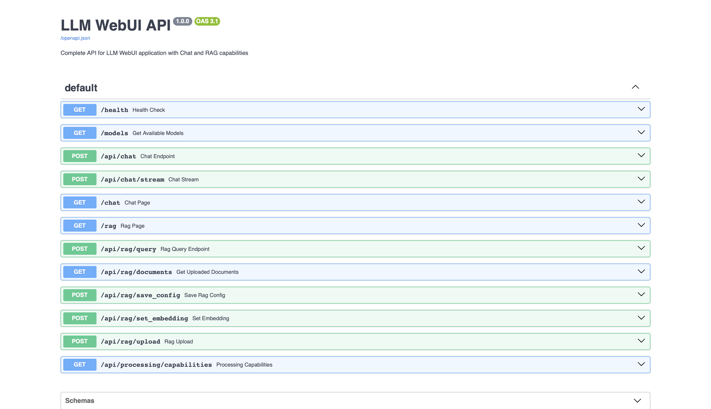

# LiteMindUI 

[](https://www.python.org/downloads/)
[](https://fastapi.tiangolo.com/)
[](https://streamlit.io/)
[](https://www.docker.com/)
[](https://hub.docker.com/r/debabratamishra1)
[](https://opensource.org/licenses/MIT)

A robust, production-ready web interface for Large Language Models (LLMs) featuring a hybrid architecture with FastAPI backend and Streamlit frontend. Built for developers, researchers, and AI enthusiasts who need a comprehensive platform for LLM interaction, document processing, and API integration.


## 🏷️ Features


## 🚀 Architecture

**Hybrid Design** - Combines the best of both worlds:

- **FastAPI Backend** (`localhost:8000`) - Entry point at `main.py` with high-performance async API and comprehensive endpoints suitable for asynchronous workload
- **Streamlit Frontend** (`localhost:8501`) - Entry point at `streamlit_app.py` with intuitive web interface and automatic backend detection
- **Intelligent Fallback** - Seamlessly switches between FastAPI and local processing based on backend availability

---

## ✨ Key Features

### 🔧 **Core Capabilities**

- **High-Performance API** - Async FastAPI backend for scalable LLM processing
- **LiteLLM SDK Routing** - Open-source Python SDK unifies inference calls without a hosted LiteLLM proxy or gateway
- **Ollama + OpenRouter** - Local-first Ollama models plus optional OpenRouter cloud routing through the same SDK transport
- **RAG Integration** - Upload PDFs, Office documents, HTML/XML, spreadsheets, structured text files, and images with enhanced local extraction and context-aware responses
- **Generation Controls** - Per-chat and per-RAG sliders for temperature and max tokens (hard cut-off)
- **Web Search Integration** - Optional real-time web search powered by SerpAPI with AI-driven synthesis
- **Realtime Voice Mode** - WebRTC voice chat with live transcription, barge-in, and streaming speech replies (Chat + RAG)
- **Multi-Model Support** - Access local and cloud-catalog Ollama models or enter OpenRouter model ids directly in the UI

### 🛠 **Developer Experience**

- **Auto-Generated API Docs** - Interactive Swagger UI at `/docs`
- **RESTful Endpoints** - Complete API for chat, RAG, and model management
- **Pure Python Stack** - Easy to extend, customize, and deploy with modular Python files for RAG and LLM interaction
- **Dependency Management** - Reproducible installs with [`uv`](https://github.com/astral-sh/uv)

### 🔒 **Production Ready**

- **Local-First** - Runs entirely on localhost, no external dependencies
- **CORS Configured** - Proper cross-origin resource sharing setup
- **Health Monitoring** - Built-in health checks and status monitoring
- **Streaming Support** - Real-time response streaming capabilities

---

### 🧭 Installation

The instructions below are tested against this repository: https://github.com/debabratamishra/litemind-ui and Docker images pushed to Docker Hub under the user `debabratamishra1` (https://hub.docker.com/u/debabratamishra1).

### Option 1: Quick Install (Recommended)

One-line installer (downloads pre-built Docker images and starts services):

```bash
curl -fsSL https://raw.githubusercontent.com/debabratamishra/litemind-ui/main/install.sh | bash
```

What this does:
- Downloads and starts pre-built Docker images from Docker Hub (user: `debabratamishra1`)
- Writes basic configuration files if missing
- Starts frontend and backend services using docker-compose

If you prefer to inspect the compose file before starting, see Option 1 (manual) below.

**Manual Docker Hub Installation**

```bash
# Download the production compose file
curl -O https://raw.githubusercontent.com/debabratamishra/litemind-ui/main/docker-compose.hub.yml

# Create required directories (only needed once)
mkdir -p uploads chroma_db storage .streamlit logs

# Start services with the provided compose file
docker-compose -f docker-compose.hub.yml up -d
```

Available Docker images (hosted on Docker Hub under `debabratamishra1`):
- Backend: https://hub.docker.com/r/debabratamishra1/litemindui-backend
- Frontend: https://hub.docker.com/r/debabratamishra1/litemindui-frontend

### Option 2: Docker Build from Source

Quick start (build and run locally with Docker):

1. Clone the repository

```bash
git clone https://github.com/debabratamishra/litemind-ui
cd litemind-ui
```

2. Setup Docker environment

```bash
make setup
# or manually: ./scripts/docker-setup.sh
```

3. Start the application

```bash
make up
# or: docker-compose up -d
```

4. Access the application

- Frontend (Streamlit): http://localhost:8501
- Backend API: http://localhost:8000
- API Documentation: http://localhost:8000/docs

Prerequisites for Docker:
- Docker and Docker Compose installed
- Ollama running on host system (if you plan to use local Ollama models) at `http://localhost:11434`
- At least 4GB RAM (8GB+ recommended)

See `DOCKER.md` for advanced configuration and troubleshooting.

Make commands for Docker Hub images (already provided in the Makefile):

```bash
make hub-up      # Start with Docker Hub images
make hub-down    # Stop Docker Hub services
make version     # Show version management options
```

### Option 3: Native (Local Python) Installation

Use this if you prefer to run services locally without Docker. These instructions assume Python 3.13+ and a virtual environment.

1. Clone the repository

```bash
git clone https://github.com/debabratamishra/litemind-ui
cd litemind-ui
```

2. Install dependencies using uv (full stack with voice)

```bash
# Install uv if you haven't already
curl -LsSf https://astral.sh/uv/install.sh | sh

# Create virtual environment and install all dependencies for local development (backend + frontend)
uv sync --group all

# Or install specific groups separately
uv sync --group backend --group frontend

# Or manually create venv and install editable package with groups
uv venv
source .venv/bin/activate
uv pip install -e .[backend,frontend]
```

> Want a lighter install without voice/realtime audio? Omit the groups to only install the minimal core.

3. Create required directories

```bash
mkdir -p uploads .streamlit
```

Environment variables you may want to set (examples):

```bash
export OLLAMA_API_URL="http://localhost:11434"
export OPENROUTER_API_KEY="your-openrouter-api-key"
export OPENROUTER_API_BASE="https://openrouter.ai/api/v1"
export DEFAULT_OPENROUTER_MODEL="meta-llama/llama-3.3-70b-instruct"
export UPLOAD_FOLDER="./uploads"
```

The app uses the LiteLLM Python SDK directly. You do not need to run the LiteLLM proxy/gateway.

Notes:
- Running the full stack natively requires additional setup (Ollama, model files) and is intended for development.
- For most users, the Docker-based Quick Install is the simplest way to get started.

### Platform notes

Quick notes for different host platforms:

- macOS (Apple Silicon / M1/M2): Docker will run amd64 images under emulation which can be slower. The installer now auto-sets DOCKER_DEFAULT_PLATFORM=linux/amd64 for arm64 hosts. If you prefer, set it manually before running the installer:

```bash
export DOCKER_DEFAULT_PLATFORM=linux/amd64
curl -fsSL https://raw.githubusercontent.com/debabratamishra/litemind-ui/main/install.sh | bash
```

- macOS (Intel) and Linux (Ubuntu): The quick-install should work as-is provided Docker and docker-compose (or the Docker Compose CLI plugin) are installed.

- Windows: Run the installer inside WSL2 (recommended) or Git Bash. Plain PowerShell/cmd doesn't provide bash by default. Example using WSL2:

```powershell
wsl
# inside WSL shell
curl -fsSL https://raw.githubusercontent.com/debabratamishra/litemind-ui/main/install.sh | bash
```

If you run into platform/architecture errors during image pull, try pulling manually and inspecting logs:

```bash
docker-compose -f docker-compose.hub.yml pull
docker-compose -f docker-compose.hub.yml up -d
docker-compose -f docker-compose.hub.yml logs -f
```
```

2. **Create required directories**

```bash
mkdir -p uploads .streamlit
```

- The `UPLOAD_FOLDER` can be customized via environment variables.

## 🔌 API Endpoints

| Endpoint | Method | Description |
| :-- | :-- | :-- |
| `/health` | GET | Backend health check |
| `/models` | GET | Available Ollama models |
| `/api/chat` | POST | Process chat messages |
| `/api/chat/stream` | POST | Streaming chat responses |
| `/api/chat/web-search` | POST | Process chat with optional web search integration |
| `/api/chat/serp-status` | GET | Check SerpAPI token configuration status |
| `/api/rag/upload` | POST | Upload documents for RAG processing |
| `/api/rag/query` | POST | Query uploaded documents with context-aware responses |
| `/api/rag/documents` | GET | List uploaded documents |
| `/api/tts/synthesize` | POST | Convert text to speech audio (MP3) |
| `/api/tts/voices` | GET | List available TTS voices |
| `/api/tts/status` | GET | Check TTS service availability |

## 💡 Usage Examples

### Chat Interface

1. Navigate to the **Chat** tab
2. **Configure Backend + Model:** Choose `Ollama` for local/cloud Ollama models or `OpenRouter` and enter a provider/model id
4. **Optional Web Search:** Enable the web search toggle to enhance responses with real-time internet data
5. Enter your message and receive AI responses
6. **Listen to Responses:** Click the 🗣️ button next to any AI response to hear it read aloud

### Realtime Voice Mode (WebRTC)

Hold full voice conversations in Chat or RAG with live transcription and streaming replies.

- Built on `streamlit-webrtc` with Pipecat Silero VAD (fallback to `webrtcvad`)
- Uses Whisper STT via transformers pipeline for accurate transcription
- Streams Kokoro TTS audio sentence-by-sentence with barge-in support
- Works in both Chat and RAG tabs with separate session memory

How to use:
1. Make sure the backend is running (FastAPI) and voice deps are installed (`uv sync --group all` for native installs; Docker images already include them).
2. Open **Chat** or **RAG** and click the 📞 button beside the input box.
3. Allow microphone access when prompted.
4. Speak naturally; live transcript appears while you talk.
5. Responses stream as speech and text. Start speaking again to interrupt/barge-in.
6. Click ✕ to exit realtime mode and return to standard chat input.

### Text-to-Speech (TTS)

LiteMindUI ships with offline, low-latency speech powered by Kokoro TTS plus a pyttsx3 fallback:

- **Offline-first** - No external API key required; runs locally
- **Expressive presets** - Warm/friendly/professional voice styles tuned for dialogue
- **Streaming-first** - Sentence-level synthesis for faster first audio and realtime mode
- **Caching** - Reuses audio for repeated responses to save time

To use TTS on any response:
1. Get a response from the AI in Chat or RAG mode
2. Click the 🗣️ button next to the response (or let realtime mode stream it automatically)
3. Audio plays inline; close with ✕ when done

### Backend Configuration

- **Local-First Setup:** Ollama is used as the default and only inference backend
- **Model Persistence:** Selected models are preserved in session state
- **Automatic Configuration:** UI adapts to available Ollama capabilities

### 🌐 API Integration

Easily interact with the LiteMindUI backend from your applications.

#### Python Example

```python
import requests

response = requests.post(
  "http://localhost:8000/api/chat",
  json={"message": "Hello, world!", "model": "llama3.1"}
)
print(response.json()["response"])
```

#### JavaScript Example (Node.js)

```javascript
const fetch = require('node-fetch');
LiteMindUI is a local-first interface for working with large language models through a FastAPI backend and Streamlit frontend. It supports chat, retrieval-augmented generation, streaming responses, optional web search, realtime voice workflows, and structured generative UI rendering.
fetch('http://localhost:8000/api/chat', {
  method: 'POST',
  headers: { 'Content-Type': 'application/json' },
  body: JSON.stringify({ message: 'Hello, world!', model: 'llama3.1' })
})
- FastAPI backend on `localhost:8000`
- Streamlit frontend on `localhost:8501`
- LiteLLM SDK transport with Ollama and OpenRouter support
- RAG for PDFs, Office files, structured text, HTML/XML, spreadsheets, and images
- Realtime voice, local speech-to-text, and offline text-to-speech
- Streaming chat and structured generative UI components



- Chat and RAG workflows in a single interface
- Provider-aware model selection for Ollama and OpenRouter
- Streaming responses with conversation memory
- Document upload and retrieval across common file formats
- Optional SerpAPI-backed web search in chat
- Realtime voice mode with Whisper STT and Kokoro TTS
- API-first backend with Swagger docs at `/docs`
[server]
address = "localhost"
port = 8501
- `main.py`: FastAPI entry point
- `streamlit_app.py`: Streamlit entry point
- `app/backend/`: API routes and backend-facing models
- `app/frontend/`: Streamlit pages, components, and services
- `app/services/`: shared services including Ollama, RAG, speech, TTS, and search
export OLLAMA_BASE_URL="http://localhost:11434"
export UPLOAD_FOLDER="./uploads"
```

### Web Search Configuration (Optional)

LiteMindUI supports optional web search integration powered by SerpAPI. When enabled, the system can retrieve real-time information from the internet and synthesize it with your local LLM.

#### Setting up SerpAPI

1. **Get your API key:**
   - Visit [https://serpapi.com/](https://serpapi.com/)
   - Sign up for a free account (100 searches/month on free tier)
   - Navigate to your dashboard to find your API key

2. **Configure the API key:**
   
   Add to your `.env` file:
   ```bash
   SERP_API_KEY=your-serpapi-key-here
   ```
   
   Or export as environment variable:
   ```bash
   export SERP_API_KEY="your-serpapi-key-here"
   ```

3. **Optional settings:**
   ```bash
   # Maximum number of search results to retrieve (default: 10)
   WEB_SEARCH_MAX_RESULTS=10
   
   # Timeout for web search requests in seconds (default: 30)
   WEB_SEARCH_TIMEOUT=30
   ```

#### Using Web Search

1. Navigate to the **Chat** tab in the UI
2. Look for the **Web Search** toggle in the prompt area
3. Enable the toggle before submitting your query
4. The system will:
   - Retrieve top 10 search results from the web
   - Synthesize the information using your selected LLM
   - Display a comprehensive response with web context

**Status Indicators:**
- The sidebar displays your SerpAPI token status (valid/missing/invalid)
- During search: "Searching web..." status message
- During synthesis: "Synthesizing results..." status message

**Fallback Behavior:**
- If the SerpAPI token is missing or invalid, the system automatically falls back to local LLM processing

The RAG ingestion stack is local-first and built on open-source packages that run on a single computer.

- **Dynamic Models:** Real-time model list fetching from Ollama backend
- **Streaming Responses:** Real-time token streaming for better UX
- **Document Processing:** Multi-format document ingestion and vectorization performed at ingestion for faster retrieval
- **Error Handling:** Comprehensive error handling with user-friendly messages

## 🔧 Troubleshooting

### Quick Fixes for Common Issues

**Docker Deployment Issues:**
- **Ollama not accessible:** Ensure Ollama is running with `ollama serve`
- **Permission errors:** Run `chmod 755 ~/.cache/huggingface ~/.ollama`
- **Port conflicts:** Check with `lsof -i :8000 :8501` and kill conflicting processes
- **Container build fails:** Clean with `make clean && make setup && make up`

**Backend Issues:**
- **Model loading errors:** Check model compatibility and available system memory

**Native Installation Issues:**
- **Module not found:** Reinstall all dependencies with `uv sync --group all` for local development
- **Missing backend packages:** Run `uv sync --group backend` 

**General Issues:**
- **Models not loading:** Verify Ollama is running and models are pulled
- Docker issues: [DOCKER.md](DOCKER.md)
- Health checks: [DOCKER_HEALTH_CHECKS.md](DOCKER_HEALTH_CHECKS.md)

## 🤝 Contributing

1. Fork the repository
2. Create a feature branch: `git checkout -b feature-name`
3. Commit changes: `git commit -am 'Add feature'`
4. Push to branch: `git push origin feature-name`
5. Submit a Pull Request
