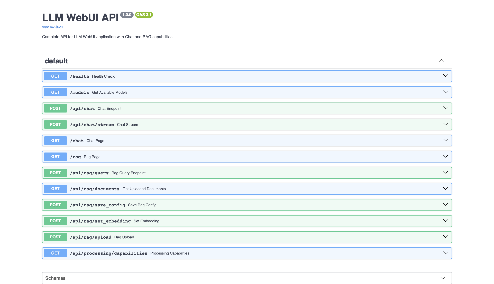

# LiteMindUI 

[](https://www.python.org/downloads/)
[](https://fastapi.tiangolo.com/)
[](https://streamlit.io/)
[](https://www.docker.com/)
[](https://hub.docker.com/r/debabratamishra/litemindui-backend)
[](https://opensource.org/licenses/MIT)
[](https://github.com/psf/black)
[](https://github.com/debabratamishra/litemindui/releases)

A robust, production-ready web interface for Large Language Models (LLMs) featuring a hybrid architecture with FastAPI backend and Streamlit frontend. Built for developers, researchers, and AI enthusiasts who need a comprehensive platform for LLM interaction, document processing, and API integration.


## 🏷️ Features


## 🚀 Architecture

**Hybrid Design** - Combines the best of both worlds:

- **FastAPI Backend** (`localhost:8000`) - Entry point at `main.py` with high-performance async API and comprehensive endpoints suitable for asynchronous workload
- **Streamlit Frontend** (`localhost:8501`) - Entry point at `streamlit_app.py` with intuitive web interface and automatic backend detection
- **Modular Services** - Includes `rag_service.py`, `ollama.py`, `file_ingest.py`, `enhanced_extractors.py`, and `enhanced_document_processor.py` for specialized functionalities
- **Intelligent Fallback** - Seamlessly switches between FastAPI and local processing based on backend availability

---

## ✨ Key Features

### 🔧 **Core Capabilities**

- ⚡ **High-Performance API** - Async FastAPI backend for scalable LLM processing
- 🧠 **Dual Backend Support** - Seamlessly switch between Ollama (local) and vLLM (Hugging Face) backends
- 📚 **RAG Integration** - Upload documents (PDFs, DOCX, TXT) with enhanced extraction and query with context-aware responses
- 🔄 **Auto-Failover** - Intelligent backend detection with graceful fallbacks
- 🤖 **Multi-Model Support** - Access to popular models through vLLM or local Ollama models

### 🛠 **Developer Experience**

- 📖 **Auto-Generated API Docs** - Interactive Swagger UI at `/docs`
- 🌐 **RESTful Endpoints** - Complete API for chat, RAG, and model management
- 🐍 **Pure Python Stack** - Easy to extend, customize, and deploy with modular Python files for RAG and LLM interaction
- 📦 **Dependency Management** - Reproducible installs with [`uv`](https://github.com/astral-sh/uv)

### 🔒 **Production Ready**

- 🏠 **Local-First** - Runs entirely on localhost, no external dependencies
- 🔐 **CORS Configured** - Proper cross-origin resource sharing setup
- ⚙️ **Health Monitoring** - Built-in health checks and status monitoring
- 📊 **Streaming Support** - Real-time response streaming capabilities

---

## 📋 Prerequisites

**For Ollama Backend:**
- Python 3.12+ (Should support earlier versions, but tested with 3.12+)
- Ollama - Running locally on `localhost:11434`
- UV Package Manager - For dependency management

**For vLLM Backend (Optional):**
- Hugging Face account and access token
- Compatible GPU (recommended for better performance)
- FastAPI backend running (automatically configured)

---

## 🛠 Installation

### Option 1: Quick Install (Recommended)

**One-Line Install with Docker Hub Images:**

```bash
curl -fsSL https://raw.githubusercontent.com/debabratamishra/litemindui/main/install.sh | bash
```

This will:
- Download and start pre-built Docker images from Docker Hub
- Set up the necessary configuration files
- Start both frontend and backend services
- Guide you through the setup process

**Manual Docker Hub Installation:**

```bash
# Download the production compose file
curl -O https://raw.githubusercontent.com/debabratamishra/litemindui/main/docker-compose.hub.yml

# Create necessary directories
mkdir -p uploads chroma_db storage .streamlit logs

# Start with Docker Hub images
docker-compose -f docker-compose.hub.yml up -d
```

**Available Docker Images:**
- **Backend**: [`debabratamishra/litemindui-backend:latest`](https://hub.docker.com/r/debabratamishra/litemindui-backend)
- **Frontend**: [`debabratamishra/litemindui-frontend:latest`](https://hub.docker.com/r/debabratamishra/litemindui-frontend)

### Option 2: Docker Build from Source

**Quick Start with Docker:**

1. **Clone the repository**
```bash
git clone https://github.com/debabratamishra/litemindui
cd litemindui
```

2. **Setup Docker environment**
```bash
make setup
# or manually: ./scripts/docker-setup.sh
```

3. **Start the application**
```bash
make up
# or: docker-compose up -d
```

4. **Access the application**
- Frontend (Streamlit): http://localhost:8501
- Backend API: http://localhost:8000
- API Documentation: http://localhost:8000/docs

**Prerequisites for Docker:**
- Docker and Docker Compose installed
- Ollama running on host system (`localhost:11434`)
- At least 4GB RAM (8GB+ recommended)

**Volume Mounts & Host Integration:**
- Automatically mounts HuggingFace cache (`~/.cache/huggingface`)
- Mounts Ollama cache (`~/.ollama`) for model persistence
- Preserves uploaded documents and vector database
- Manages vLLM processes on host system

📖 **For detailed Docker setup, troubleshooting, and advanced configuration, see [DOCKER.md](DOCKER.md).**

**Docker Hub vs Build from Source:**
- **Docker Hub (Recommended)**: Pre-built images, faster deployment, automatic updates
- **Build from Source**: Latest development features, customizable builds, development mode

**Make Commands for Docker Hub:**
```bash
make hub-up      # Start with Docker Hub images
make hub-down    # Stop Docker Hub services
make version     # Show version management options
```

**Common Docker Issues:**
- Ollama connection problems → Check if Ollama is running on `localhost:11434`
- Permission errors → Run `chmod 755 ~/.cache/huggingface ~/.ollama`
- Port conflicts → Use `lsof -i :8000 :8501` to check port usage
- Build failures → Run `make clean && make setup && make up`

### Option 3: Native Installation

1. **Clone the repository**

```bash
git clone https://github.com/debabratamishra/litemindui
cd litemindui
```

2. **Install dependencies**

```bash
uv pip install -r requirements.txt
```

3. **Create required directories**

```bash
mkdir -p uploads .streamlit
```

- The `UPLOAD_FOLDER` can be customized via environment variables.

## 🔌 API Endpoints

| Endpoint | Method | Description |
| :-- | :-- | :-- |
| `/health` | GET | Backend health check |
| `/models` | GET | Available Ollama models |
| `/api/chat` | POST | Process chat messages (supports both Ollama and vLLM backends) |
| `/api/chat/stream` | POST | Streaming chat responses (supports both backends) |
| `/api/rag/upload` | POST | Upload documents for RAG processing |
| `/api/rag/query` | POST | Query uploaded documents with context-aware responses |
| `/api/rag/documents` | GET | List uploaded documents |
| `/api/vllm/models` | GET | Available vLLM models and configuration |
| `/api/vllm/set-token` | POST | Configure Hugging Face access token |

## 💡 Usage Examples

### Chat Interface

1. Navigate to the **Chat** tab
2. **Select Backend:** Choose between Ollama (local) or vLLM (Hugging Face)
3. **Configure Models:** 
   - For Ollama: Select from locally installed models
   - For vLLM: Choose from popular models or enter custom model names
4. Enter your message and receive AI responses

### Document Q\&A (RAG)

1. Switch to the **RAG** tab
2. Upload PDF, TXT, or DOCX files
3. **Choose Backend:** RAG works with both Ollama and vLLM backends
4. Query your documents with natural language
5. Get contextually relevant answers

### Backend Switching

- **Seamless Integration:** Switch between backends without losing your current page
- **Model Persistence:** Backend-specific model selections are preserved
- **Automatic Configuration:** UI adapts based on selected backend capabilities

### 🌐 API Integration

Easily interact with the LiteMindUI backend from your applications.

#### Python Example

```python
import requests

response = requests.post(
  "http://localhost:8000/api/chat",
  json={"message": "Hello, world!", "model": "llama3.1"}
)
print(response.json()["response"])
```

#### JavaScript Example (Node.js)

```javascript
const fetch = require('node-fetch');

fetch('http://localhost:8000/api/chat', {
  method: 'POST',
  headers: { 'Content-Type': 'application/json' },
  body: JSON.stringify({ message: 'Hello, world!', model: 'llama3.1' })
})
  .then(res => res.json())
  .then(data => console.log(data.response))
  .catch(err => console.error(err));
```

For a complete list of endpoints and request/response formats, visit the [Swagger UI](http://localhost:8000/docs):



## 🔧 Configuration

### Streamlit Settings

Create `.streamlit/config.toml`:

```toml
[server]
address = "localhost"
port = 8501
```

### Environment Variables

```bash
export OLLAMA_BASE_URL="http://localhost:11434"
export UPLOAD_FOLDER="./uploads"
```

## 🎯 Advanced Features

- **Backend Detection:** Automatic FastAPI availability checking with local fallback
- **Dynamic Models:** Real-time model list fetching from Ollama backend
- **Streaming Responses:** Real-time token streaming for better UX
- **Document Processing:** Multi-format document ingestion and vectorization performed at ingestion for faster retrieval
- **Error Handling:** Comprehensive error handling with user-friendly messages

## 🔧 Troubleshooting

### Quick Fixes for Common Issues

**Docker Deployment Issues:**
- **Ollama not accessible:** Ensure Ollama is running with `ollama serve`
- **Permission errors:** Run `chmod 755 ~/.cache/huggingface ~/.ollama`
- **Port conflicts:** Check with `lsof -i :8000 :8501` and kill conflicting processes
- **Container build fails:** Clean with `make clean && make setup && make up`

**Backend Issues:**
- **vLLM backend not working:** Verify Hugging Face token is valid and model exists
- **Backend switching problems:** Clear browser cache and reload the page
- **Model loading errors:** Check model compatibility and available GPU memory

**Native Installation Issues:**
- **Module not found:** Reinstall dependencies with `uv pip install -r requirements.txt`
- **Streamlit not starting:** Check if port 8501 is available
- **FastAPI errors:** Verify Python 3.12+ and check logs in terminal

**General Issues:**
- **Models not loading:** Verify Ollama is running and models are pulled
- **Upload failures:** Check `uploads` directory permissions
- **RAG not working:** Ensure documents are uploaded and processed successfully

📖 **For comprehensive troubleshooting guides:**
- Docker issues: [DOCKER.md](DOCKER.md)
- Health checks: [DOCKER_HEALTH_CHECKS.md](DOCKER_HEALTH_CHECKS.md)

## 🤝 Contributing

1. Fork the repository
2. Create a feature branch: `git checkout -b feature-name`
3. Commit changes: `git commit -am 'Add feature'`
4. Push to branch: `git push origin feature-name`
5. Submit a Pull Request
