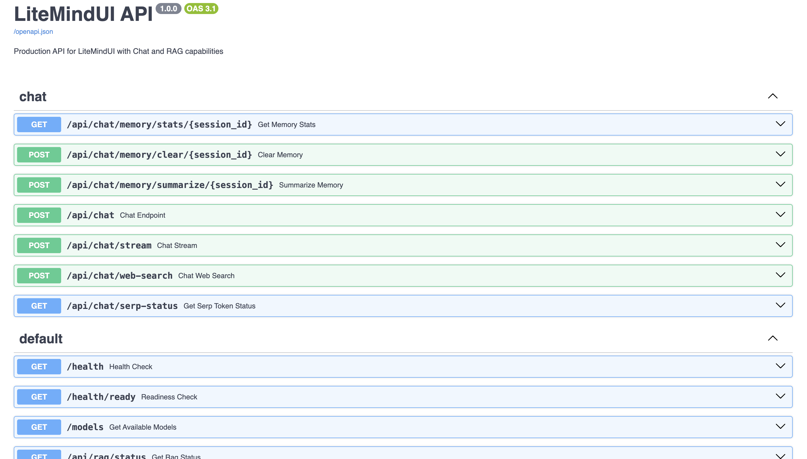

# Documentation

LiteMindUI keeps the repository root focused on setup and navigation. Deeper operational notes live under `docs/`.

## Guides

- [`../README.md`](../README.md) - project overview and quick start
- [`docker/README.md`](docker/README.md) - Docker workflows, compose files, health checks, and troubleshooting
- [`docker/publishing.md`](docker/publishing.md) - Docker image publishing and release automation

## Runtime surfaces

| Surface | URL | Notes |
| --- | --- | --- |
| Frontend | `http://localhost:8501` | Streamlit UI |
| Backend API | `http://localhost:8000` | FastAPI app |
| API docs | `http://localhost:8000/docs` | OpenAPI / Swagger UI |
| Health check | `http://localhost:8000/health` | Backend readiness |

